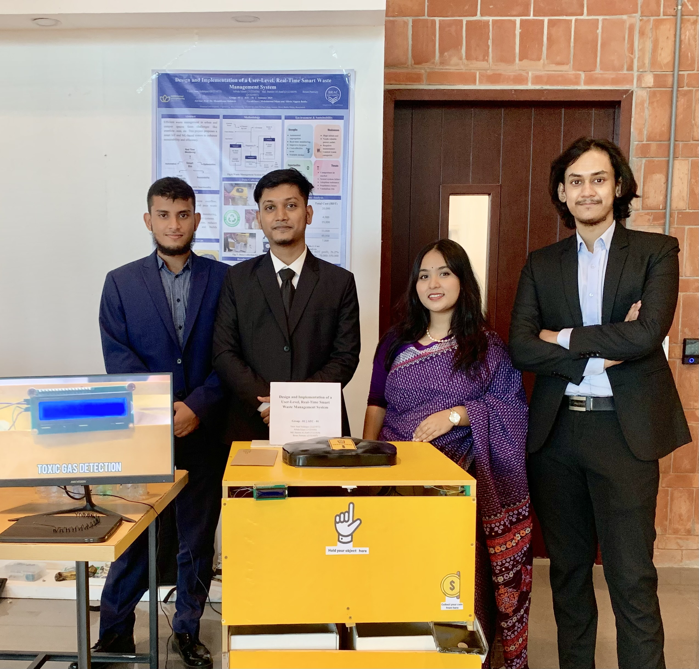

<!-- README.md -->

  

# ♻️ Design & Implementation of a User-Level, Real-Time Smart Waste Management System

**Project overview**  
This is an **IoT-based smart waste management prototype** built for a university campus. It combines a Raspberry Pi edge device, fill-level sensors and a lightweight YOLOv8n model to classify waste and push live telemetry to a cloud dashboard. The system enables real-time monitoring, prevents overflow, and supports data-driven collection planning. During tests the prototype reached **92% sorting accuracy** with **sub-second update latency**.

> “Alhamdulillah for everything. The journey with our project has truly been one of the most memorable parts of my undergrad life.  
> Working together on our FYDP project taught me what real teamwork, patience, and dedication mean. From brainstorming to debugging, every moment was worth it.”  
> — *Afrida Islam, Group 01 (EEE, BRAC University)*

---

<!-- Three-column “broad” overview (compact, not oversized headings) -->
<table>
  <tr>
    <td align="center" width="33%">
       
      <strong>Recognition</strong> 
      2nd Runners-up — FYDP
    </td>
    <td align="center" width="33%">
       
      <strong>Core stack</strong> 
      Raspberry Pi · IoT sensors · YOLOv8n · MQTT/Cloud
    </td>
    <td align="center" width="33%">
       
      <strong>Impact</strong> 
      Reduce overflow • Optimize routes • Raise awareness
    </td>
  </tr>
</table>

---

<h2 align="center">⚡ Quick Facts</h2>

| 🧩 Feature | 💡 Description |
|:--|:--|
| **🧠 Edge Inference** | YOLOv8n running on **Raspberry Pi**, providing real-time classification with ultra-low latency. |
| **📡 Sensing** | Combination of **ultrasonic** and **optical** sensors for bin level detection, plus a camera for image-based waste sorting. |
| **☁️ Telemetry** | Uses **MQTT/HTTPS** to send live data to a **cloud dashboard** with instant alert hooks for maintenance. |
| **⚙️ Performance (Test)** | Achieved **92% classification accuracy** with an **average update latency under 1 second.** |

---

  

---
<h2 align="center">🏆 Achievement</h2>

  

---

---

<h2 align="center">📸 Our Team</h2>

  

---

<h4 align="center">
  🎥 Watch it in action — our real-time waste detection and alert demo from the FYDP showcase!
</h4>

<h2 align="center">🧠 Technologies</h2>

  <b>Raspberry Pi · IoT Sensors · YOLOv8n · Cloud Dashboard</b>

---

<h2 align="center">🌱 Goal</h2>

  <b>A smarter, cleaner, and more sustainable future.</b>
  

